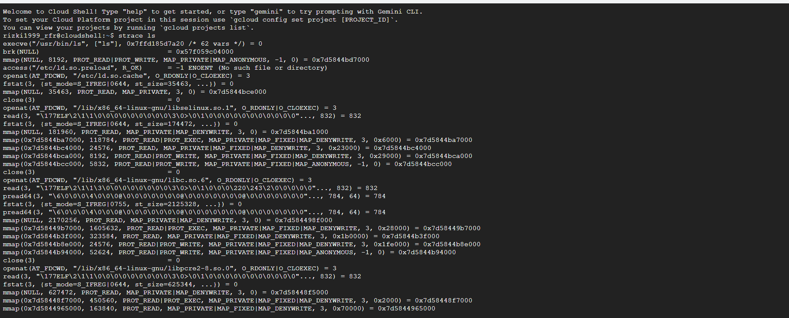
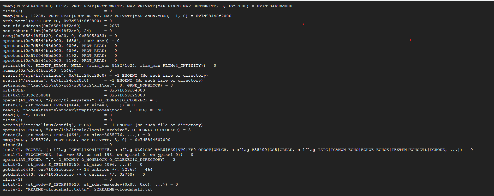
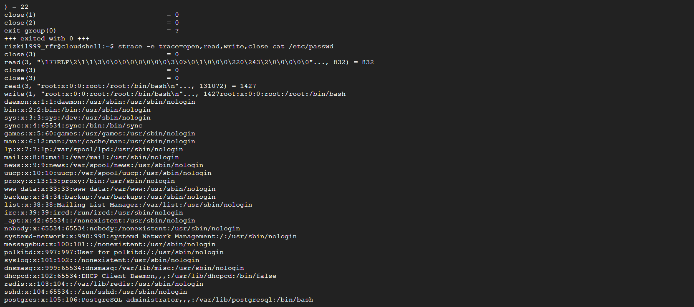
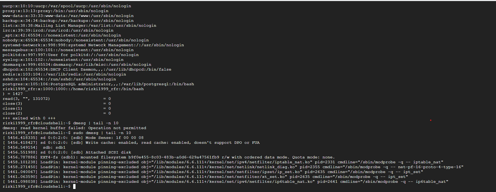

# Laporan Praktikum Minggu 2
Topik: Struktur System Call dan Fungsi Kernel

---

## Identitas
- **Nama**  : Rizki Fernanda Rahardi  
- **NIM**   : 250320573 
- **Kelas** : 1DSRA

---

## Tujuan

Tujuan praktikum minggu ini adalah untuk memahami bagaimana sistem operasi mengelola komunikasi antara aplikasi dan kernel lewat system call. Di praktikum ini, kita akan belajar tentang berbagai jenis system call, seperti yang berhubungan dengan file, proses, perangkat, dan komunikasi antar proses, dan bagaimana eksekusinya bekerja mulai dari aplikasi di user mode sampai ke kernel.
Melalui eksperimen, kita akan melihat langsung bagaimana aplikasi melakukan panggilan ke system call, misalnya dengan menggunakan strace untuk memonitor system call yang terjadi saat kita menjalankan perintah di Linux, seperti ls atau cat. Kita juga akan melihat bagaimana kernel mengelola file, misalnya saat membuka, membaca, atau menutup file menggunakan system call.
Selain itu, kita juga akan memahami proses transisi antara user mode dan kernel mode, serta bagaimana sistem memastikan bahwa transisi ini aman dan tidak mengganggu kestabilan sistem. Praktikum ini juga bertujuan untuk membuat kita lebih paham bagaimana sistem operasi Linux bekerja di tingkat dasar, terutama dalam mengelola sumber daya sistem dan menjaga keamanan aplikasi yang berjalan di atasnya.


## Dasar Teori

1.	System Call sebagai Penghubung Aplikasi dan Kernel: System call adalah cara aplikasi di user mode untuk meminta layanan dari kernel di kernel mode. Intinya, aplikasi nggak bisa langsung berinteraksi dengan perangkat keras, jadi mereka lewat system call supaya bisa mengakses fitur-fitur yang disediakan oleh sistem operasi.
2.	Perpindahan antara User Mode dan Kernel Mode: Setiap kali aplikasi melakukan system call, terjadi perpindahan dari user mode (tempat aplikasi berjalan) ke kernel mode (tempat sistem operasi mengelola sumber daya). Proses ini disebut mode switching, di mana sistem memastikan aplikasi nggak melakukan hal-hal yang bisa merusak sistem.
3.	Jenis-Jenis System Call: Ada banyak jenis system call, misalnya yang berkaitan dengan file seperti open, read, write, dan close. Ada juga yang mengelola proses seperti fork, exec, dan wait, serta untuk komunikasi antar proses 
4.	Keamanan dan Validasi dalam System Call: Setiap system call yang diajukan oleh aplikasi perlu divalidasi oleh sistem operasi untuk memastikan itu aman. Jadi, kernel akan memeriksa permintaan aplikasi sebelum dieksekusi untuk mencegah aplikasi yang mungkin berbahaya atau merusak sistem.
5.	Menggunakan Strace untuk Memantau System Call : Dengan menggunakan alat seperti strace, kita bisa melihat langsung system call yang terjadi saat aplikasi dijalankan. Ini membantu kita memahami bagaimana aplikasi berinteraksi dengan kernel dan apa yang terjadi di balik layar ketika program dieksekusi.

---

## Langkah Praktikum

1.	Persiapkan Lingkungan Kerja

2.	Eksperimen 1 

 - Jalankan perintah strace ls.

 - Catat 5-10 system call pertama yang muncul dan fungsinya.

 - Simpan hasil analisis dalam file syscall_ls.txt.

3.	Eksperimen 2 

- Jalankan perintah strace -e trace=open,read,write,close cat /etc/passwd.

- Amati dan catat bagaimana file dibuka, dibaca, dan ditutup oleh kernel.
- Simpan hasil analisis.
  
4.	Eksperimen 3
   
 - Jalankan perintah dmesg | tail -n 10.
  	
5.	Commit dan Push Hasil ke GitHuB

  - Setelah eksperimen selesai, lakukan commit dan push hasil ke GitHub.
- Pastikan semua file hasil praktikum sudah ditambahkan.
  
6.	Buat Laporan Praktikum
-	Dokumentasikan hasil eksperimen dan analisis dalam file laporan.md.
- Tulis analisis singkat mengenai pentingnya system call, bagaimana OS memastikan keamanan selama transisi user-kernel, dan contoh system call di Linux.

---

## Kode / Perintah
Tuliskan potongan kode atau perintah utama:
```bash
strace ls
strace -e trace=open,read,write,close cat /etc/passwd
dmesg | tail -n 10
```
---

## Hasil Eksekusi
Sertakan screenshot hasil percobaan atau diagram:








---

## Analisis

1.	 Pentingnya System Call dalam Keamanan OS

System call memiliki peran penting dalam menjaga keamanan sistem operasi. Dengan menggunakan system call, aplikasi tidak dapat mengakses perangkat keras atau sumber daya sistem secara langsung. Sebagai penghubung antara aplikasi di user mode dan kernel di kernel mode, system call memungkinkan kernel untuk mengontrol dan memverifikasi setiap permintaan dari aplikasi sebelum dilaksanakan. Hal ini sangat penting untuk mencegah aplikasi yang tidak sah atau berbahaya melakukan tindakan yang dapat merusak sistem atau mengakses data sensitif tanpa izin yang sesuai.

2.	 Transisi User Mode ke Kernel Mode

Proses transisi antara user mode dan kernel mode melalui system call merupakan bagian integral dari pengamanan OS. Setiap kali aplikasi memanggil system call, kernel memverifikasi permintaan tersebut dan melaksanakannya dengan kontrol penuh. Dengan cara ini, aplikasi tidak bisa langsung mengakses sistem atau perangkat keras tanpa melalui mekanisme yang terjaga oleh kernel. Transisi ini memastikan bahwa hanya operasi yang sah dan sesuai izin yang dapat dieksekusi oleh sistem.

3.	Contoh System Call yang Sering Digunakan

Beberapa system call yang sering digunakan di Linux antara lain:
-	Open : Digunakan untuk membuka file atau perangkat.
-	Read : Digunakan untuk membaca data dari file.
-	Write : Digunakan untuk menulis data ke file.
-	Close : Digunakan untuk menutup file setelah digunakan.
System call ini memfasilitasi aplikasi untuk berinteraksi dengan file sistem dan perangkat keras dengan cara yang terkontrol oleh kernel.

4.	 Alur Eksekusi System Call

Proses eksekusi system call dimulai ketika aplikasi di user mode mengirimkan permintaan ke kernel. Kernel kemudian memverifikasi permintaan tersebut dan mengeksekusinya sesuai dengan hak akses yang berlaku. Setelah eksekusi selesai, hasilnya dikembalikan ke aplikasi di user mode. Alur ini memastikan bahwa semua interaksi antara aplikasi dan kernel dilaksanakan dengan pengawasan kernel, menjaga integritas sistem dan mencegah akses yang tidak sah.

---

## Kesimpulan
Dari praktikum ini, dapat disimpulkan bahwa system call adalah mekanisme yang sangat penting dalam menghubungkan aplikasi di user mode dengan kernel di kernel mode. Melalui system call, aplikasi dapat melakukan operasi yang melibatkan perangkat keras dan sumber daya sistem dengan pengawasan kernel, yang menjaga keamanan dan stabilitas sistem operasi.

Praktikum ini juga memperlihatkan berbagai jenis system call yang digunakan untuk pengelolaan file, proses, perangkat, dan komunikasi antar proses. Setiap system call berfungsi untuk memastikan aplikasi dapat berinteraksi dengan sistem secara aman tanpa memberikan akses langsung ke kernel.

Secara keseluruhan, system call berperan sebagai lapisan pengaman yang mengatur interaksi antara user mode dan kernel mode, mencegah aplikasi melakukan tindakan yang bisa merusak atau mengakses data sensitif. Dengan adanya system call, sistem operasi dapat berfungsi dengan lebih aman dan terkontrol.


---

## Quiz

1. Apa fungsi utama system call dalam sistem operasi?
Fungsi utama dari system call dalam sistem operasi adalah untuk menjadi jembatan antara aplikasi yang berjalan di user mode dan kernel yang berada di kernel mode. System call memungkinkan aplikasi untuk mengakses fitur-fitur yang ada di sistem operasi, seperti membaca atau menulis file, mengalokasikan memori, atau mengelola proses, tanpa memberikan akses langsung ke perangkat keras atau bagian inti sistem. Dengan kata lain, system call memastikan bahwa aplikasi dapat berinteraksi dengan kernel secara terkontrol, yang sangat penting untuk menjaga keamanan dan stabilitas sistem. Kernel memverifikasi setiap permintaan yang datang dari aplikasi untuk memastikan bahwa operasi yang dilakukan sah dan tidak membahayakan sistem.

2. Sebutkan 4 kategori system call yang umum digunakan.
Ada beberapa kategori system call yang sering digunakan dalam sistem operasi, di antaranya:
•	File Management: Kategori ini mencakup system call yang berhubungan dengan pengelolaan file, seperti membuka, membaca, menulis, dan menutup file. Contoh system call yang termasuk dalam kategori ini adalah open, read, write, dan close.
•	Process Management: System call dalam kategori ini digunakan untuk mengelola proses, seperti membuat proses baru, menunggu proses selesai, atau mengakhiri proses. Beberapa contoh system call di kategori ini adalah fork, exec, wait, dan exit.
•	Device Management: Kategori ini berisi system call yang mengelola perangkat keras atau I/O, seperti mengakses perangkat atau mengatur status perangkat. Contoh system call dalam kategori ini adalah ioctl, read, dan write untuk komunikasi dengan perangkat.
•	Inter-Process Communication (IPC): System call ini digunakan untuk mengatur komunikasi antar proses. Beberapa contoh system call dalam kategori ini adalah pipe, shmget, dan msgget yang memungkinkan proses berbagi data atau berkomunikasi dengan proses lain.

3. Mengapa system call tidak bisa dipanggil langsung oleh user program?
System call tidak bisa dipanggil langsung oleh program pengguna karena aplikasi yang berjalan di user mode tidak memiliki izin untuk mengakses bagian-bagian kritis dari sistem seperti kernel atau perangkat keras secara langsung. Jika aplikasi bisa langsung memanggil system call, itu berisiko merusak sistem, baik karena kesalahan pemrograman atau potensi ancaman keamanan. Oleh karena itu, system call dirancang untuk menjadi mekanisme yang mengontrol interaksi antara user mode dan kernel mode. Dengan cara ini, kernel dapat memverifikasi dan memastikan bahwa permintaan yang datang dari aplikasi aman dan sah sebelum dieksekusi, sehingga menjaga integritas dan stabilitas sistem operasi secara keseluruhan.

---

## Refleksi Diri
Tuliskan secara singkat:
- Apa bagian yang paling menantang minggu ini?  
- Bagaimana cara Anda mengatasinya?  

---

**Credit:**  
_Template laporan praktikum Sistem Operasi (SO-202501) – Universitas Putra Bangsa_
