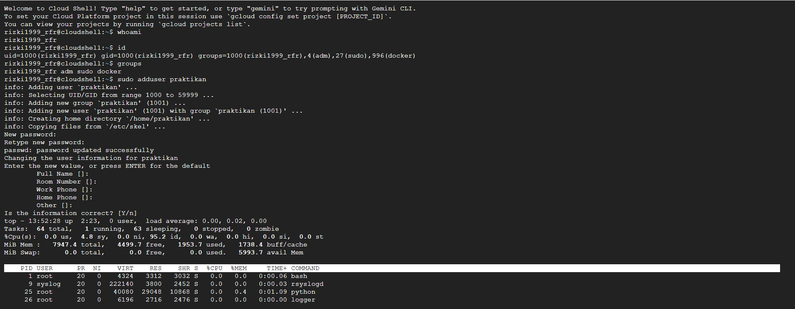
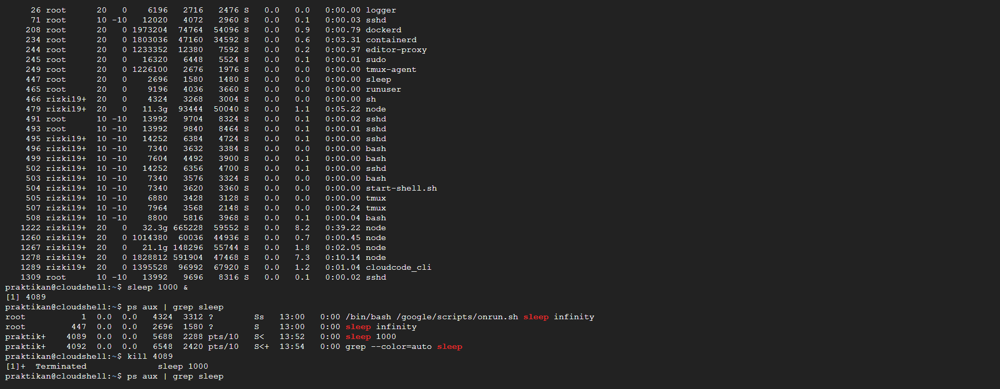
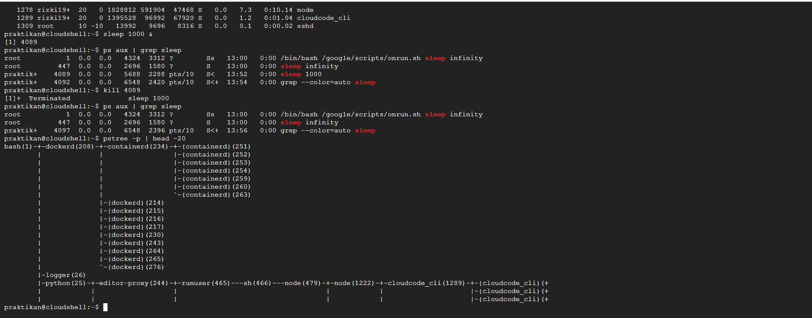

# Laporan Praktikum Minggu [4]
Topik: [Manajemen Proses dan User di Linux]

---

## Identitas
- **Nama**  : Rizki Fernanda Rahardi
- **NIM**   : [250320573]  
- **Kelas** : [1DSRA]

---

## Tujuan

Tujuan dari praktikum minggu ini adalah agar saya dapat memahami dan mengelola proses serta user di sistem operasi Linux dengan lebih baik. Saya ingin belajar bagaimana menampilkan, memantau, dan mengontrol proses yang berjalan, termasuk menghentikan proses tertentu menggunakan PID. Selain itu, praktikum ini bertujuan untuk memahami konsep manajemen user dan grup, bagaimana membuat user baru, serta mengatur hak aksesnya. Dengan memahami manajemen proses dan user, saya juga dapat melihat kaitannya dengan keamanan sistem, sehingga dapat menjaga sistem tetap aman dari akses atau penggunaan yang tidak sah. Praktikum ini sekaligus membantu saya terbiasa menggunakan perintah dasar Linux secara praktis dan mendokumentasikan hasilnya secara sistematis.

---

## Dasar Teori

1.	Manajemen Proses di Linux
   
Proses adalah unit eksekusi terkecil dalam sistem operasi yang sedang berjalan. Setiap program yang dijalankan pada Linux akan menjadi sebuah proses, yang memiliki ID unik yang disebut PID (Process ID). Linux menggunakan beberapa alat untuk mengelola proses-proses ini, seperti perintah ps yang menampilkan status proses yang sedang berjalan, dan top untuk melihat penggunaan sumber daya sistem secara real-time. Manajemen proses penting agar sistem dapat berjalan secara efisien dan stabil, serta memudahkan pengelolaan aplikasi yang sedang aktif.

2.	Hierarki Proses
   
Setiap proses di Linux memiliki hubungan induk dan anak. Proses induk pertama yang berjalan adalah init (atau systemd pada distribusi modern), yang akan memulai proses-proses lainnya dalam sistem. Hierarki proses ini memungkinkan Linux untuk mengelola proses-proses yang berjalan secara terstruktur. Dengan menggunakan perintah pstree, kita dapat melihat struktur pohon dari proses yang berjalan, sehingga memudahkan pemantauan dan pengontrolan proses yang lebih besar dan kompleks.

3.	Manajemen User dan Keamanan Sistem
   
Setiap pengguna di Linux memiliki ID unik yang disebut UID (User ID) dan grup yang berfungsi untuk mengelompokkan pengguna berdasarkan hak akses. Manajemen user yang baik memungkinkan administrator untuk memberikan atau membatasi hak akses ke file dan proses dalam sistem. Pengguna dengan hak akses terbatas dapat membantu menjaga sistem dari potensi risiko keamanan. Misalnya, user root memiliki hak istimewa penuh dalam sistem, sementara user lain bisa dibatasi aksesnya. Perintah seperti adduser dan passwd digunakan untuk membuat dan mengelola akun pengguna baru.

4.	Kontrol Proses dengan Perintah kill
   
Perintah kill digunakan untuk menghentikan atau mengontrol proses yang sedang berjalan. Setiap proses memiliki PID yang dapat digunakan untuk menghentikan proses tersebut dengan perintah kill. Hal ini berguna ketika sebuah aplikasi atau proses tidak merespon dan perlu dihentikan paksa. Sedangkan killall memungkinkan kita untuk menghentikan semua instance dari sebuah aplikasi berdasarkan nama prosesnya, bukan berdasarkan PID-nya.

5.	Hubungan antara Manajemen Proses dan Keamanan
   
Manajemen proses yang efektif dapat mendukung keamanan sistem dengan memastikan bahwa proses yang tidak sah atau berbahaya dapat dihentikan dengan cepat. Selain itu, manajemen user juga berperan penting dalam membatasi akses hanya kepada pengguna yang berwenang. Dengan memantau dan mengontrol proses secara cermat, serta memastikan hak akses pengguna dikelola dengan baik, kita dapat mencegah penyalahgunaan atau potensi ancaman yang dapat merusak integritas dan keamanan sistem Linux.


---

## Langkah Praktikum

1.	Setup Lingkungan Kerja
Pastikan menggunakan Linux (Ubuntu/WSL) dan login sebagai user non-root. Siapkan folder kerja di direktori praktikum/week4-proses-user/.

2.	Eksperimen 1 
Jalankan perintah whoami, id, dan groups untuk melihat identitas dan grup user. Buat user baru dengan sudo adduser praktikan, set password dengan sudo passwd praktikan, dan uji login ke user baru.

3.	Eksperimen 2 
Gunakan ps aux | head -10 untuk melihat proses yang berjalan dan top -n 1 untuk tampilan real-time. Simpan screenshot hasil top.

4.	Eksperimen 3 
Jalankan sleep 1000 &, lalu temukan PID dengan ps aux | grep sleep. Hentikan proses dengan kill <PID> dan pastikan proses berhenti.

5.	Eksperimen 4 
Jalankan pstree -p | head -20 untuk melihat hierarki proses dan identifikasi proses induk. Catat hasilnya.

6.	Dokumentasi
Ambil screenshot dan simpan di screenshots/. Buat laporan di laporan.md dan jelaskan setiap eksperimen.

7.	Commit dan Push
Lakukan git add ., git commit -m "Minggu 4 - Manajemen Proses & User", dan git push origin main untuk mengunggah hasil praktikum.


---

## Kode / Perintah
Tuliskan potongan kode atau perintah utama:
```bash
whoami
id
groups
sudo adduser praktikan
sudo passwd praktikan
ps aux | head -10
top -n 1
sleep 1000 &
ps aux | grep sleep
kill <PID>	
pstree -p | head -20

```

---

## Hasil Eksekusi
Sertakan screenshot hasil percobaan atau diagram:







---

## Analisis

Pada percobaan ini, saya mempelajari beberapa aspek penting dalam manajemen user dan proses di Linux.
Di eksperimen pertama, saya mengetahui identitas user yang sedang aktif dengan menjalankan perintah `whoami`, `id`, dan `groups`. Hal ini berguna untuk memastikan saya bekerja di bawah user yang benar dan memahami hak akses yang ada. Pembuatan user baru menggunakan `adduser` juga menunjukkan bagaimana cara menambah user dalam sistem yang membutuhkan pengaturan hak akses.
Pada eksperimen kedua, dengan menggunakan perintah `ps aux` dan `top`, saya dapat memantau proses yang berjalan di sistem, termasuk penggunaan sumber daya seperti CPU dan memori. Ini sangat membantu dalam mengevaluasi kinerja sistem secara real-time.
Selanjutnya, eksperimen ketiga menunjukkan bagaimana mengontrol proses dengan `kill`. Saya dapat menghentikan proses tertentu dengan memanfaatkan PID yang didapat, hal ini penting untuk mengelola proses yang tidak merespons atau mengganggu kinerja sistem.
Eksperimen terakhir tentang hierarki proses menggunakan `pstree` memberi saya gambaran tentang struktur pohon dari proses-proses yang berjalan. Ini memberikan pemahaman tentang hubungan antara proses induk dan anak dalam sistem.
Secara keseluruhan, praktikum ini membantu saya memahami cara Linux mengelola user, grup, dan proses, serta memberikan keterampilan praktis untuk mengelola sistem secara efektif.

---

## Kesimpulan

Kesimpulan dari praktikum ini adalah bahwa manajemen user dan proses di Linux merupakan aspek penting untuk menjaga kinerja dan keamanan sistem. Melalui praktikum, saya memahami cara mengetahui identitas user, membuat user baru, dan memeriksa hak akses. Selain itu, saya belajar memantau proses yang berjalan, menghentikan proses tertentu, serta memahami hierarki proses dalam sistem. Praktikum ini menunjukkan bahwa pengelolaan user dan proses yang tepat membantu menjaga sistem tetap stabil, aman, dan efisien.

---

## Quiz

1.	Fungsi dari Proses init atau systemd dalam Sistem Linux
   
Proses init (atau systemd pada distribusi Linux yang lebih baru) memiliki peran penting sebagai proses induk (parent process) yang pertama kali dijalankan oleh kernel saat sistem booting. Proses ini bertanggung jawab untuk memulai dan mengelola semua proses lainnya, seperti menjalankan layanan sistem (services), memanage berbagai sesi pengguna, serta mengatur konfigurasi perangkat keras. Sebagai proses induk, init atau systemd juga mengawasi dan menangani proses-proses yang berjalan di bawahnya, memastikan sistem berjalan dengan baik dan stabil.

2.	Perbedaan antara kill dan killall
   
Perintah kill digunakan untuk mengirimkan sinyal ke sebuah proses berdasarkan PID (Process ID) tertentu. Dengan kill, kita bisa menghentikan atau mengatur proses lain untuk berhenti, tergantung pada sinyal yang dikirim. Di sisi lain, perintah killall digunakan untuk mengirimkan sinyal ke semua proses dengan nama tertentu. Sebagai contoh, jika kita ingin menghentikan semua instance dari aplikasi tertentu yang sedang berjalan, kita bisa menggunakan killall diikuti dengan nama aplikasi tersebut, tanpa perlu mengetahui PID-nya.

3.	Mengapa User root Memiliki Hak Istimewa di Sistem Linux
   
User root di Linux adalah superuser yang memiliki hak akses penuh terhadap seluruh sistem. Ini berarti user root dapat melakukan hampir semua tindakan di sistem, termasuk mengubah file sistem, menginstal atau menghapus perangkat lunak, serta mengelola user lain dan hak aksesnya. Keistimewaan ini diperlukan untuk mengelola dan merawat sistem dengan efektif, terutama dalam mengatasi masalah yang memerlukan perubahan konfigurasi sistem atau perangkat keras. Karena hak akses yang luas ini, user root perlu digunakan dengan hati-hati, karena kesalahan atau penyalahgunaan hak akses dapat merusak sistem atau menyebabkan masalah keamanan.


---

## Refleksi Diri
Tuliskan secara singkat:
- Apa bagian yang paling menantang minggu ini?  
- Bagaimana cara Anda mengatasinya?  

---

**Credit:**  
_Template laporan praktikum Sistem Operasi (SO-202501) – Universitas Putra Bangsa_
